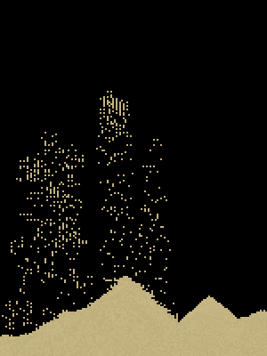

# Falling Sand




## Overview

This repository contains a Python-based falling sand simulation where each sand particle accelerates due to gravity until it encounters an obstacle. This simulation mimics physical properties and provides a visual representation of granular physics in a 2D grid using Pygame for visualization.

## Features

- **Physics-Based Falling**: Sand particles fall with acceleration, creating a realistic simulation of gravity.
- **Collision Detection**: Particles stop falling when they encounter obstacles.
- **Grid Visualization**: The simulation grid is visualized using Pygame for an interactive experience.
- **Customizable Parameters**: Adjust gravity, time step, and grid size to experiment with different scenarios.

## Getting Started

### Prerequisites

- Python 3.x

## Installation

1. Clone the repository
2. Navigate to the project directory

### Installing Required Libraries

This simulation uses Pygame for visualization. If you haven't installed Pygame yet, you can install it using pip. Open your terminal and run the following command:

```sh
pip install pygame
```

### Running the simulation

To run the simulation, run `main.py`
```sh
python main.py
```
this should start a pygame window where you can add grains of sand by clicking or draging your mouse

# Configuration
In `config.py` there are options to customize everything
- CELL_SIZE is the dimension of each sand grain
- GRID_DIMS is the dimension of the simulation
- CLICK_RANGE window range for sand cloud generation
- ACCELERATION sand acceleration
- ACCELERATION_RANDOMNESS plus or minus range from original accelaration (lower bounded at 1)


## Mathematical Formulas

The simulation uses basic kinematic equations to model the behavior of sand particles under the influence of gravity:

1. **Velocity Update**:

   $\ v = v + a \cdot t $

   - `v`: Current vertical velocity of the sand particle.
   - `a`: Acceleration due to gravity.
   - `t`: Time step for each iteration.

2. **Position Update**:

   $y = y + v \cdot t$

   - `y`: Current vertical position of the sand particle.
   - `v`: Current vertical velocity.
   - `t`: Time step for each iteration.

3. **Collision Detection**:
   - The simulation checks if the new position `y` of the sand particle is either at the bottom of the grid or at a position occupied by a sand grain. If a collision is detected, the particle checks both sides. If both sides are free it randomly falls left or right

These equations are applied iteratively in the simulation loop to update the position and velocity of each sand particle until they come to rest due to a collision or reach the bottom of the grid.
